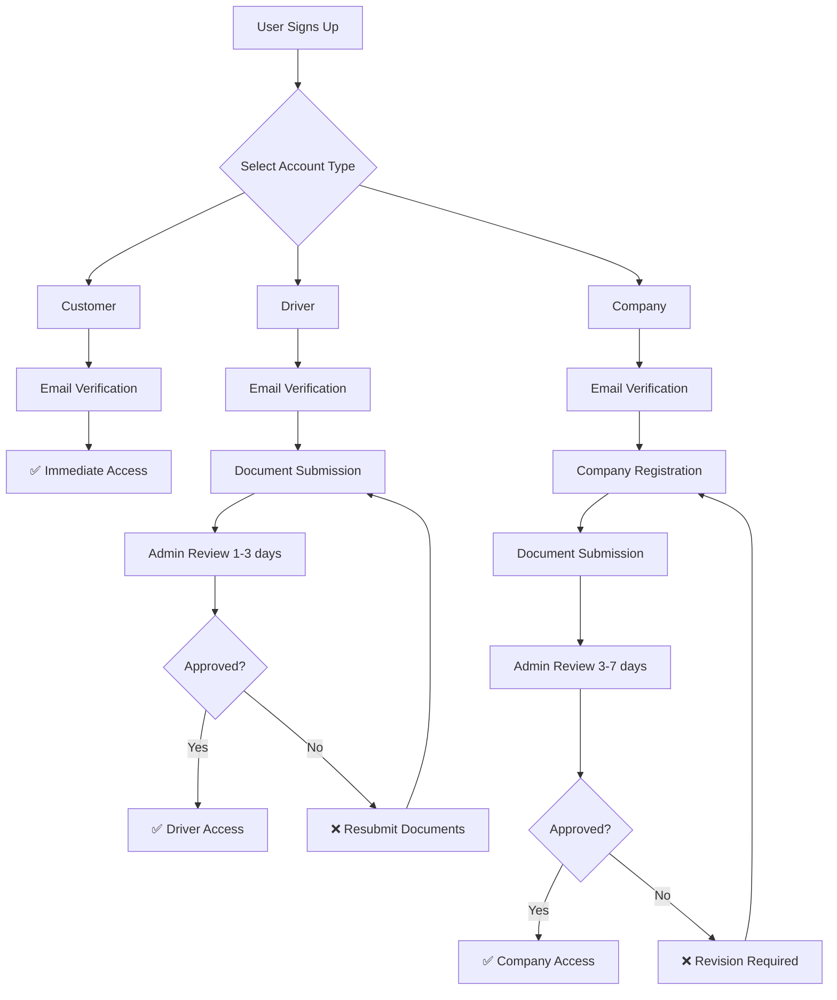

# 🔐 Strict Account Type System

This document outlines the comprehensive account type system with strict separation and registration flows implemented in the Towing Online app.

## 🎯 Overview

The app now enforces **strict account separation** with three distinct account types that cannot be switched between. Each account type has specific permissions, registration requirements, and verification processes.

## 📋 Account Types

### 1. 👤 Customer Account
**Purpose**: Request towing services and pay for them

**Registration**: 
- ✅ Immediate activation after email verification
- ✅ No additional documents required
- ✅ Can start using the app immediately

**Permissions**:
- ✅ Request towing services
- ✅ Pay via Xendit (virtual account, e-wallet, bank transfer)
- ✅ Chat with assigned driver only
- ✅ Rate and tip drivers after service completion
- ✅ View order history and receipts

**Restrictions**:
- ❌ Cannot receive or accept service requests
- ❌ Cannot manage drivers or company operations
- ❌ Cannot switch to Driver or Company account

---

### 2. 🚗 Driver Account
**Purpose**: Accept service requests and perform towing jobs

**Registration Requirements**:
- 📄 **KTP (Indonesian ID Card)**: Photo and details
- 📄 **SIM (Driver's License)**: Photo and expiry date
- 📄 **STNK (Vehicle Registration)**: Vehicle documentation
- 🏦 **Bank Account Details**: For payout processing
- ✅ **Document Verification**: Admin approval required (1-3 business days)

**Verification Process**:
1. Submit all required documents
2. Admin review (1-3 business days)
3. Account activation upon approval
4. Rejection requires resubmission with corrections

**Permissions**:
- ✅ Accept towing jobs (one at a time)
- ✅ Receive payments via Xendit payouts
- ✅ Chat with assigned customers
- ✅ View job history and earnings
- ✅ Update availability status
- ✅ Receive real-time job notifications

**Restrictions**:
- ❌ Cannot request towing services as a customer
- ❌ Cannot manage company operations
- ❌ Cannot switch to Customer or Company account

---

### 3. 🏢 Company Account
**Purpose**: Manage multiple drivers and fleet operations

**Registration Requirements**:
- 📄 **Business License (SIUP/NIB)**: Company registration documents
- 📄 **Tax ID (NPWP)**: Tax registration certificate
- 📄 **Company Registration (Akta Pendirian)**: Legal company documents
- 📄 **Insurance Certificate**: Company insurance (optional)
- 📄 **Operating Permit**: Transportation operation license (optional)
- 📄 **Contact Person KTP**: ID of company representative
- 🚛 **Fleet Information**: Vehicle details and documentation
- 🏦 **Company Bank Account**: For payment processing
- ✅ **Comprehensive Verification**: Admin approval required (3-7 business days)

**Verification Process**:
1. Complete 12-step registration process
2. Submit all required documents
3. Admin review (3-7 business days)
4. Account activation upon approval
5. Rejection requires revision and resubmission

**Permissions**:
- ✅ Add and manage drivers under company
- ✅ View all jobs performed by company drivers
- ✅ Receive split payouts (company + driver revenue sharing)
- ✅ Access analytics dashboard
- ✅ Generate financial reports
- ✅ Handle disputes and insurance claims
- ✅ Invite drivers to join company

**Restrictions**:
- ❌ Cannot directly request towing services (company is not a customer)
- ❌ Cannot perform individual driver jobs
- ❌ Cannot switch to Customer or Driver account

## 🚨 Critical Separation Rules

### 1. **No Account Switching**
- Account types are **permanently fixed** once selected during registration
- Users cannot "switch" between Customer, Driver, or Company roles
- To use a different account type, users must create a **separate account with a different email**

### 2. **Separate Registration Flows**
- **Customer**: Email verification only → Immediate access
- **Driver**: Email verification → Document submission → Admin verification → Account activation
- **Company**: Email verification → Comprehensive registration → Document submission → Admin verification → Account activation

### 3. **Role-Based Access Control**
- Each account type has **distinct permissions** and **restricted access**
- UI/UX adapts based on account type
- API endpoints enforce role-based restrictions

### 4. **Verification Requirements**
- **Customer**: No verification needed (immediate access)
- **Driver**: Document verification required before accepting jobs
- **Company**: Comprehensive business verification required before operations

## 💰 Payment & Payout System

### Customer Payments
- Pay via **Xendit** (virtual account, e-wallet, bank transfer)
- Payments are **split automatically**:
  - Driver/Company receives their share
  - Platform takes commission
  - Xendit processes transaction fees

### Driver Payouts
- Receive payments via **Xendit disbursements**
- Payout to verified bank account or e-wallet
- **Independent drivers**: Keep 70-80% of service fee
- **Company drivers**: Split based on company agreement

### Company Revenue
- Receive **split payments** for jobs performed by company drivers
- **Revenue sharing model**: Company + Driver + Platform
- Access to **financial reporting** and **analytics**

## 🔄 Account Verification Flow

## 🛡️ Security & Compliance

### Document Verification
- **KTP validation**: Name, address, and ID number verification
- **SIM validation**: License validity and expiry date checks
- **Vehicle documentation**: STNK and insurance verification
- **Business documents**: Legal entity and tax compliance verification

### Data Protection
- **Encrypted storage** of sensitive documents
- **Role-based access** to personal information
- **GDPR compliance** for data handling
- **Audit trails** for all verification activities

### Fraud Prevention
- **Document authenticity** checks
- **Identity verification** processes
- **Bank account validation** for payouts
- **Business registration** verification for companies

## 📱 User Experience

### Account Selection
- **Clear role descriptions** with requirements
- **Visual indicators** for verification status
- **Warning messages** about permanent account type selection
- **Progress indicators** for registration completion

### Verification Status
- **Real-time status updates** during verification
- **Clear messaging** about required actions
- **Estimated timeframes** for approval
- **Rejection reasons** with guidance for resubmission

### Dashboard Access
- **Role-specific dashboards** with appropriate features
- **Verification gates** preventing access until approved
- **Helpful guidance** for completing requirements

## 🔧 Technical Implementation

### Database Schema
- **Strict role enforcement** at database level
- **Verification status tracking** for each account type
- **Document storage** with secure access controls
- **Audit logging** for all verification activities

### API Security
- **Role-based middleware** for endpoint protection
- **JWT token validation** with role claims
- **Permission checks** on all sensitive operations
- **Rate limiting** to prevent abuse

### Frontend Guards
- **Route protection** based on account type and verification status
- **Component-level permissions** for feature access
- **Real-time verification status** updates
- **Graceful error handling** for unauthorized access

## 📞 Support & Troubleshooting

### Common Issues
1. **Document Rejection**: Review rejection reasons and resubmit with corrections
2. **Verification Delays**: Contact support if verification exceeds estimated timeframe
3. **Account Access**: Ensure email is verified and account type is properly selected
4. **Payment Issues**: Verify bank account details and payout settings

### Contact Support
- **In-app support**: Available for all account types
- **Email support**: For document and verification issues
- **Phone support**: For urgent payment and account issues
- **FAQ section**: Self-service for common questions

---

## 🎉 Benefits of This System

### For Users
- **Clear expectations** about account capabilities
- **Secure verification** process
- **Role-appropriate features** and interface
- **Professional service** quality

### For Platform
- **Regulatory compliance** with transportation laws
- **Quality control** through verification
- **Fraud prevention** via document checks
- **Scalable business model** with proper revenue sharing

### For Business
- **Trust and safety** for all users
- **Professional driver** and company network
- **Reliable payment** processing
- **Comprehensive reporting** and analytics

This strict account system ensures **platform integrity**, **user safety**, and **regulatory compliance** while providing a **professional towing service** experience for all stakeholders.