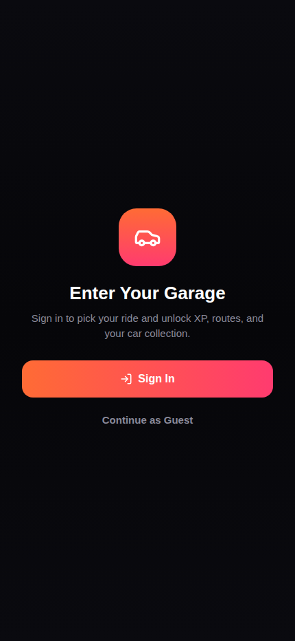
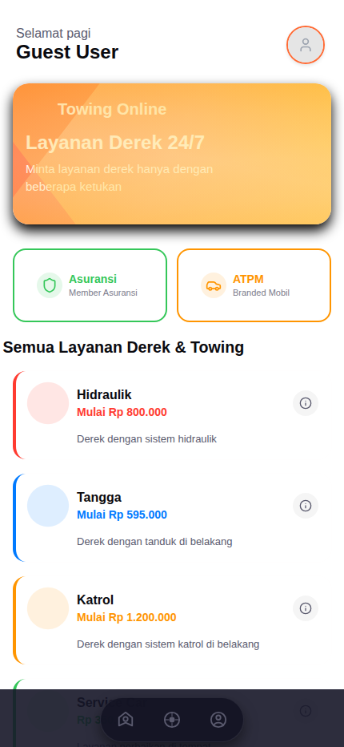
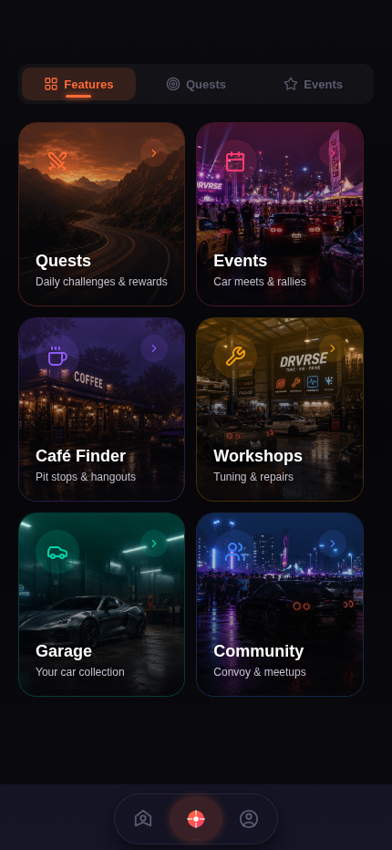
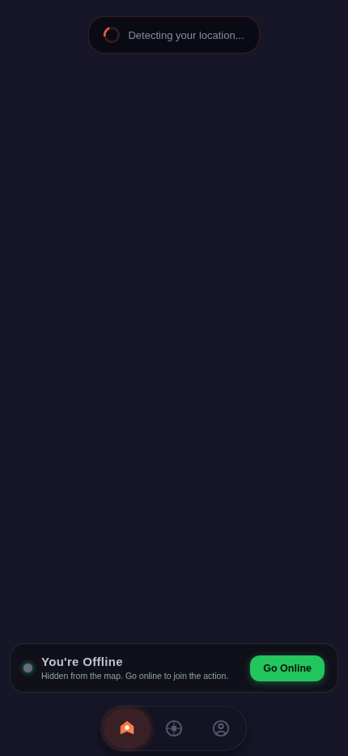
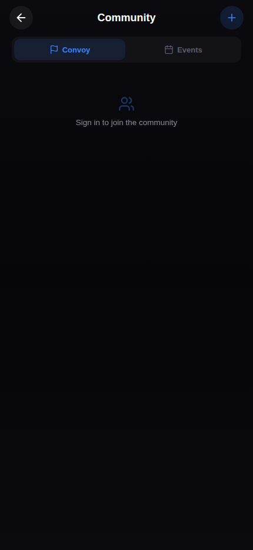
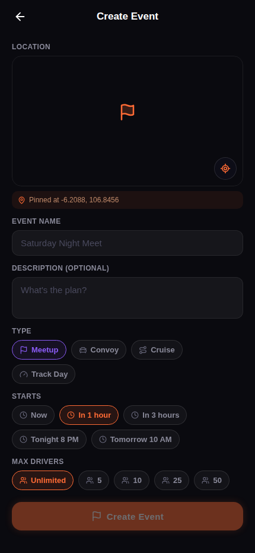
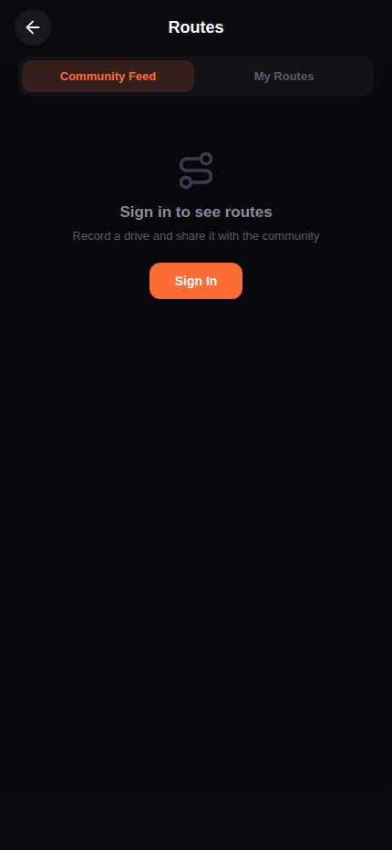
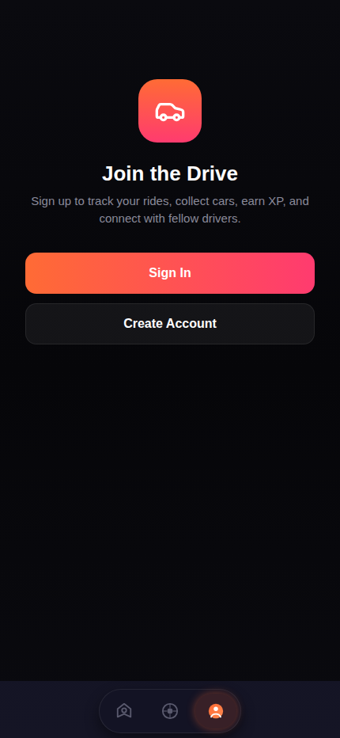

# Dokumentasi Fungsionalitas — Driveverse (Build Terbaru)

Dokumen ini merangkum fungsionalitas yang **sudah berhasil diimplementasikan** pada aplikasi Driveverse (Expo/React Native), berdasarkan hasil menjalankan build terbaru secara langsung (web preview) dan pemeriksaan kode sumber di `expo/`.

> Cara verifikasi: aplikasi dijalankan dengan `npx expo start --web`, di-drive dengan Chromium headless (Playwright), lalu setiap layar utama di-screenshot. Screenshot ada di `docs/screenshots/`.

---

## 1. Alur Masuk Aplikasi (Onboarding / Auth Gate)

- **Garage Gate** (`app/index.tsx` → `app/select-car.tsx`): layar pertama yang tampil adalah "Enter Your Garage" — pengguna memilih mobil dari koleksi sebelum masuk ke aplikasi utama.
- **Sign In** (`app/login.tsx`) dan **Create Account** (`app/signup.tsx`) — autentikasi email/password via Supabase Auth.
- **Continue as Guest** — mode tamu, langsung masuk ke Home tanpa akun (data publik seperti daftar layanan towing tetap tampil).
- **Sistem Akun Berlapis** (`ACCOUNT_SYSTEM_GUIDE.md`, `hooks/useAuthStore.ts`): 3 tipe akun terpisah dan permanen — **Customer** (aktif langsung), **Driver**, dan **Company** (keduanya butuh verifikasi dokumen). Tidak ada fitur ganti tipe akun (`canSwitchRoles: false`).
- **Verifikasi Dokumen** (`DOCUMENT_VERIFICATION_SYSTEM.md`, `components/AccountVerificationScreen.tsx`): upload KTP/SIM/STNK untuk Driver, dokumen legalitas usaha untuk Company, dengan status pending/verified/rejected.

## 2. Home (Layanan Towing)

- Sapaan personalisasi ("Selamat pagi, Guest User") + tombol profil.
- Banner promosi **Towing Online — Layanan Derek 24/7**.
- Shortcut ke **Asuransi** (member asuransi) dan **ATPM** (layanan resmi merek mobil).
- Daftar lengkap **jenis layanan derek**: Hidraulik, Tangga, Katrol, Sertifikasi, dll — lengkap dengan harga mulai dan detail info (modal `TowingTypeDetailModal`).

## 3. Drive Hub (Fitur Gamifikasi & Sosial)

Tab **Drive** menjadi pusat navigasi ke seluruh fitur non-towing, ditampilkan sebagai grid kartu dengan 3 sub-tab (Features / Quests / Events):

- **Quests** — tantangan harian & reward (lihat §6).
- **Events** — car meet & rally (lihat §5).
- **Café Finder** — pencarian tempat nongkrong/pit-stop terdekat.
- **Workshops** — bengkel untuk tuning & perbaikan.
- **Garage** — koleksi mobil milik pengguna.
- **Community** — convoy & meetup sosial.

## 4. Peta & Live Driving

- **Live map** (`app/(tabs)/map.tsx`) dengan deteksi lokasi GPS real-time, dasar peta dari `react-native-maps` + overlay tile **Mapbox** (migrasi dari Google Maps — lihat `GOOGLE_MAPS_SETUP.md` vs commit migrasi Mapbox).
- Toggle **Online/Offline** — status "kelihatan" di peta untuk pengguna lain.
- **Nearby Places** (`app/nearby-places.tsx`) — pencarian POI (kafe, bengkel, SPBU) berbasis lokasi.
- **Drive Session Tracking** — mulai/berhenti sesi berkendara, merekam rute sebagai polyline.
- **Toggle gaya peta** (light/dark map style) di menu Filters.
- Pencarian lokasi & autocomplete (`components/MapboxSearch.tsx`).

## 5. Komunitas, Event & Convoy

- **Community Hub** (`app/community.tsx`) — tab Convoy & Events, browse/join komunitas pengendara.
- **Create Event** (`app/create-event.tsx`) — **fitur terbaru**: halaman pembuatan event khusus dengan location picker berbasis peta bawaan (pin lokasi manual, koordinat live), nama & deskripsi event, 4 tipe event (**Meetup, Convoy, Cruise, Track Day**), pilihan waktu mulai (Now / 1 jam / 3 jam / jadwal custom), dan batas jumlah peserta (Unlimited/5/10/25/50).
- **Event Detail** (`app/event/[id].tsx`) — join/leave event, jumlah peserta, akses ke group chat event.
- **Event Management** (`app/event/[id]/manage.tsx`) — khusus host: lihat & ban peserta, kirim pesan ke grup.
- **Convoy / Party** (`app/convoy.tsx`, `app/convoy/[id].tsx`) — membentuk convoy, undang kontak, peran leader/member, status publik/privat.
- Realtime tracking lokasi antar-anggota event/convoy (`EVENTS_REALTIME_SETUP.md`, `hooks/useOnlineUsers.ts`).

## 6. Progres & Gamifikasi

- **Sistem XP & Rank** (`hooks/useXPStore.ts`, `app/ranks.tsx`) — kurva level, badge rank (crown/trophy/flame) berdasarkan total XP.
- **Daily Quest Engine** (`DAILY_QUEST_SYSTEM.md`, `hooks/useQuestStore.ts`) — 3 quest harian (Easy/Medium/Hard) yang auto-tervalidasi dari aktivitas GPS, reset harian (UTC rollover).
- **Trip & Route History** — setiap sesi berkendara tersimpan sebagai trip (`app/trip/[id].tsx`) dengan statistik jarak/kecepatan/XP, dan bisa disimpan sebagai rute publik/privat yang bisa dibagikan (`app/routes.tsx`, `app/route/[id].tsx`).

## 7. Chat & Pesan

- **Chat 1:1 untuk permintaan derek** (`app/chat.tsx`, `hooks/useChatStore.ts`) — real-time via Supabase, termasuk pesan lokasi.
- **Messages Inbox** (`app/messages/index.tsx`) — daftar percakapan DM & grup, pencarian, compose pesan baru.
- **Group Chat** (`app/messages/group/[id].tsx`) — chat grup untuk event/convoy (`hooks/useGroupChatStore.ts`).
- **Notifikasi in-app** (`hooks/useNotificationStore.ts`, `components/NotificationBanner.tsx`).

## 8. Profil & Garasi

- **Profil pengguna** (`app/(tabs)/profile.tsx`, `app/user/[id].tsx`) — profil sendiri maupun profil publik pengguna lain, memakai komponen `ProfileScreen` yang sama.
- **Statistik per mobil** (`hooks/useCarDriveStats.ts`) — jarak tempuh, XP, kecepatan rata-rata/tertinggi, jumlah trip per mobil di garasi.
- **Kartu trip dengan toggle publik/privat** — redesign terbaru pada halaman profil.
- **Rating & Tip driver** (`hooks/useRatingTipStore.ts`, `components/RatingTipScreen.tsx`).

## 9. Dompet & Transaksi

- **Top-up saldo** (`app/top-up.tsx`, `app/top-up-history.tsx`) — nominal top-up cepat + riwayat.
- **Riwayat transaksi** (`app/transaction-history.tsx`, `app/payment-history.tsx`, `app/(tabs)/transactions.tsx`) — filter berdasarkan tipe transaksi, ringkasan status pembayaran.
- **Order history** (`app/(tabs)/orders.tsx`) — saat ini masih *empty state* ("Tidak ada pesanan") — riwayat pesanan towing belum terisi data live.
- Catatan: integrasi pembayaran pihak ketiga (Xendit) dan alur *online-towing request* sebelumnya sudah **dihapus** dari codebase (lihat riwayat commit) — sistem pembayaran saat ini bersifat provider-agnostic untuk split payment/tip.

## 10. Layanan Resmi & Asuransi

- **ATPM** (`app/(tabs)/atpm.tsx`) — form permintaan layanan resmi dari agen pemegang merek, mengirim data ke WhatsApp.
- **Member Asuransi** (`app/(tabs)/member-asuransi.tsx`) — syarat & ketentuan member asuransi, tombol kontak langsung ke chat.

---

## Ringkasan Perubahan Terbaru (dari riwayat commit)

- Migrasi seluruh pemanggilan Directions/Geocoding/Places dari Google Maps ke **Mapbox**.
- **Create Event** dipisah jadi halamannya sendiri dengan location picker bawaan (bukan lagi bagian dari alur lain).
- Optimasi ukuran aset gambar: **46MB → 3MB**.
- Penghapusan integrasi pembayaran **Xendit** dan alur *online-towing request*.
- Perbaikan navigasi tab Events/Convoy yang sebelumnya nyangkut di tab Community lama.
- Redesign kartu trip di profil + toggle privasi trip publik/privat.

## Catatan Keterbatasan Saat Uji Coba

- Environment sandbox tidak memiliki akses jaringan keluar ke Supabase/Mapbox asli (memakai kredensial placeholder), sehingga tile peta dan data real-time tidak termuat penuh pada screenshot — namun seluruh struktur UI, navigasi, dan komponen berhasil dirender dan diverifikasi berjalan.
